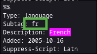

# Contributing

New features and major changes will probably be made solely by [@crqch](https://github.com/crqch) in accordance with [@SwingTheVine](https://github.com/SwingTheVine), to maintain the project's goal.

Anyway, things that are needed to be done can be accessed in the 'Issues' tab of the repository.

If you do contribute code, then the it should meet those criteria:

- complex elements/heavy logic are extracted to separate components/functions,
- good code readability and quality,
- added 'en' locale keys for new components/pages (instead of leaving plain text).

## Localization

Providing translations for new languages is currently the most important task.

Translating can be done in two ways:

 <details>
    <summary>
      <b>Translate using a web GUI editor (suggested)</b>
    </summary>

### Setup

1. Open our repository Inlang [Fink editor](https://fink.inlang.com/github.com/crqch/bluemarble-website).
2. Authenticate using GitHub to your account.
3. Click on Fork button in the bottom.


4. Check the BCP-47 language tag of the language you want to translate. You can find all language tags on [this website](https://www.iana.org/assignments/language-subtag-registry/language-subtag-registry). Tip: You can use Ctrl + F to find for a language, like `French`. For French, the language tag is `fr`



5. In top left select 'en' language and the language tag (`fr`) you want to translate. If it doesn't exist, create one.


6. You can now either go through all of the translations and fix those that are missing or are wrong, or you can filter them additionally, for example by missing translations.

7. After completing the translation (and also during it to not lose any data), click on the button Push to update your fork.


8. Once you're completely finished and are sure there are no mistakes, click on Open pull request


9. Describe the details of what your changes bring. Do not remove the last line (`Preview the messages on ...`). After that click on Create pull request


</details>

 <details>
    <summary>
      <b>Translate using a code editor</b>
    </summary>

### Setup

1. Clone the repository: `git clone https://github.com/crqch/bluemarble-website`
2. Open the directory: `cd bluemarble-website`
3. Open the editor of choice in the directory: `vscode .`, `zed .`, `vscodium .` etc.

### Translating an existing locale

To translate an existing locale, you should go to `packages/client/messages/en.json` file and compare it with your locale (`packages/client/messages/[lang].json`). Then, copy over the keys that your locale lacks. If you are working on the `master` branch, you can tell which translations are missing by visiting the website, picking your locale, and seeing that something isn't translated (and is in english).

### Adding a new locale

To add a new locale, you should go to `packages/client/messages/en.json` file, copy the contents of it, create a new file in the same directory (`packages/client/messages/`), with name `[locale].json`, where `[locale]` is the code value of your language from [this table](https://www.unicode.org/cldr/charts/47/supplemental/languages_and_scripts.html).

Next, without changing the keys (like `home_section1_title` or `NAME`) translate the values to your language.

  </details>

### Translating Criteria

- You must keep any `a`, `p`, `span` tags etc. including all properties.

> Example

```
<a href=\"telemetry\" class=\"href\">used concurrently by 20,000+ users</a>
```

gets translated to

```
<a href=\"telemetry\" class=\"href\">używany przez ponad 20 000 użytkowników</a>
```

Tags are everything in between of arrow brackets: <>

- `NAME` and `EMOJI` values in your language relate to the language name written in respective language (for example: English, Polski, Español) and a flag emoji of a country that links to the language. In case of a language that is spoken by multiple countries (like English), pick one country.
