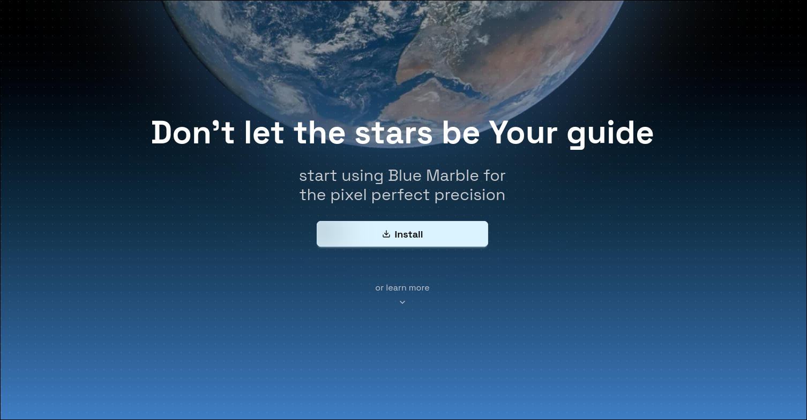

# The Blue Marble Website

An official homepage for the open source project [BlueMarble](https://github.com/SwingTheVine/Wplace-BlueMarble).

Technologies used: svelte-kit, tailwindcss, daisyui

## Get Started

> Whether you want to contribute or run the project locally for whatever reason, here are the steps to get you going

1. Clone the repository

`git clone https://github.com/crqch/bluemarble-website`

2. Install the dependencies

`bun i` or `npm i` if you're not cool (jk)

3. Run the dev server

`bun dev` or `npm run dev`

4. The website is reachable at [`localhost:5173`](https://localhost:5173)

## Contributing

For contributing details see [`CONTRIBUTING`](/docs/CONTRIBUTING.md)
